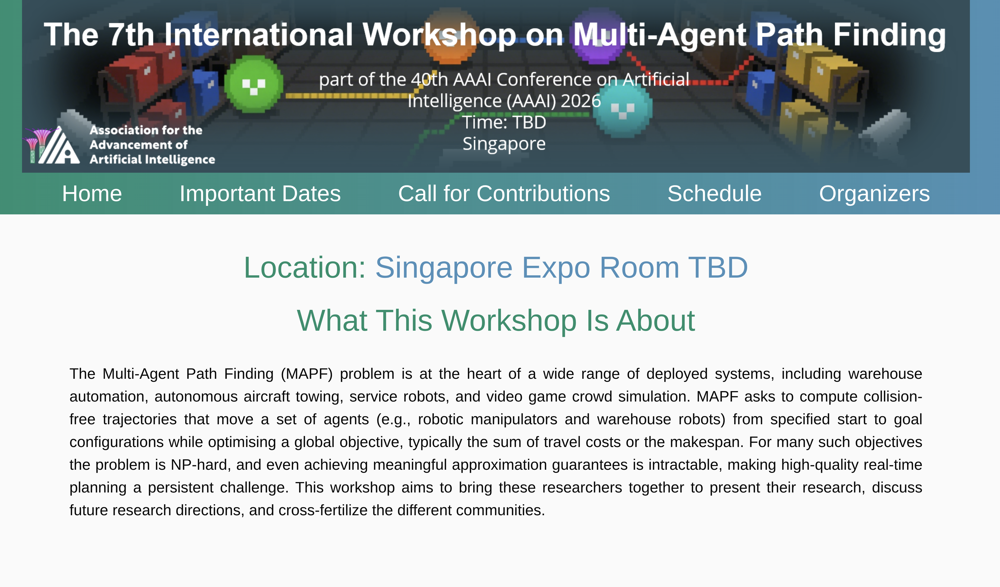

Here is the github repo for the AAAI 2026 Workshop on Multi-Agent Path Finding. Below we describe some basics of how to edit and view the website.

## Seeing the Website

The current version on GitHub can be seen at [the following link](http://mapf-workshop.github.io/aaai26):

```
http://mapf-workshop.github.io/aaai26
```

## Editing the Website

After you clone the repo, you can just make edits in a text editor like VSCode. All HTML elements (structure) are in corresponding `index.html` files. The one in the base directory is the main page and all style is handled by `assets/main.css`, so edit this to change things like font size/space, inheritance, etc.

To see your changes in real time, just run 

```
python -m http.server
```

in the base directory. Then you should be able to see changes at `http://localhost:8000`. If changes don't seem to be taking effect (especially changing things like images), try opening the page in an incognito browser or clearing your cache first.
